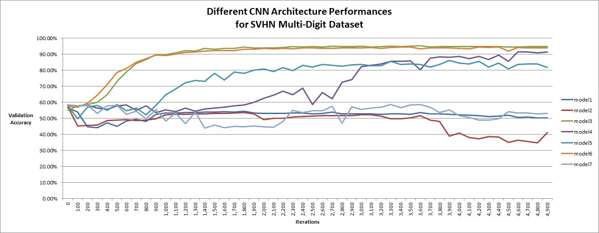

# SVHN Multi-digit Dataset Project
- Arman Uygur # au2205
- Jonathan Galsurkar #jfg2150
- Nitesh Surtani #ns3148

# The folder contains 3 jupyter notebooks:
1) SVNH Model: Contains main code for CNN architecture. 
2) preprocessing: This takes input as directory names belonging to train, test and extra. This file stores intermediate files this_sizes, and h5 file for the final output
3) preprocessing_combine_data: This takes training, test and extra h5 files and combines them into a single SVHN_data_grey.h5 file.

- First run all of the cells in preprocessing.ipynb by uncommenting process=train, test and extra part of the code. This will create temperory image_size.csv, bounding_boxes.csv and h5 files for all 3 sets: train, test and extra.
This takes care that the process doesn't runs out of memory and also restores dump if the temperory files were previously created.

- Preprocessing_combined_data.ipynb file reads the data stored in train.h5, test.h5 and extra.h5 and converts it to a single file SVHN_data_grey.h5 file

- SVHN contains the code to run two of the best peforming models described in the report. Run each cell from the top.

Jupyter -> Restart and Run All for all three notebooks in the following order: preprocssing.ipynb, preprocessing_combine_data.ipynb, SVHM Model.ipynb

Tensorflow version 1.4

## Results
During 5,000 iterations, every 100 iteration, we evaluated the model using a small validation set and saved the best performing one as our final model. In essence, model may start over-fitting at some point and this will reflect to our validation set's performance. We chose to use this method instead of early stopping, in hopes to catch a better local optimum.
Best model from validation set yielded 95.59% test accuracy.

  

For this paper, we tried 7 different models with slightly different architectures and compared their performances. We believe that all those models should yield similar test accuracies if trained enough (for instance deeper models with high units should take more iteration to converge so comparing all of them at 5,000 iterations may not be best method but we did speed vs accuracy trade off by cutting the training at 5000)

  

Model descriptions of compared models:

  

